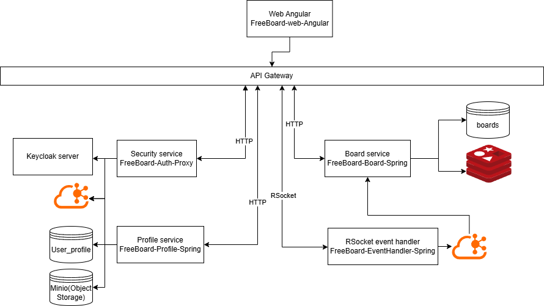

# 🧩 FreeBoard Preview

**FreeBoard** — это аналог Miro с возможностью совместной работы в реальном времени, поддержкой WebSocket и RSocket.

> 📁 Этот репозиторий служит как **документация и превью** архитектуры и ключевых компонентов проекта **FreeBoard**.

---

## 📌 Описание проекта

FreeBoard — это современная онлайн-доска, которая предоставляет пользователям следующие возможности:

- 🧱 Создание досок и управление доступом.
- 👥 Совместное редактирование содержимого в реальном времени.
- ✏️ Добавление и изменение фигур и связей на доске.
- 🔄 Синхронная работа с другими пользователями через WebSocket/RSocket.

---

## 🏗️ Архитектура

Проект построен на основе микросервисной архитектуры:

### 🎯 Основные сервисы

- **Board Service** — управление досками и доступом
- **Profile service** — сервис профилей, обработка аватарок и bio, использует MinIO для хранилища файлов
- **Auth proxy service** — сервис выступающий в виде proxy для аунтификации
- **EventHandler service** — сервис для поддержиния WebSocket соединения с клиентом, производит первичную обработку, распределяет эвенты по топикам kafka для дальнейшей обработки микросервисами

### 🗃️ Хранилище и события

- **Redis** — быстрое хранение и кэширование активных досок.
- **MongoDB** — долговременное хранилище данных.
- **PostgreSQL** — база данных используемая в keycloak и сервисе профилей.
- **MinIO** — объектное хранилище, для хранения файлов.
- **Kafka** — распределённая шина событий для микросервисов.

---

## 🔐 Аутентификация

- 🛡️ Используется **Keycloak** для управления пользователями и ролями.
- 🔑 Поддержка JWT токенов для безопасной авторизации.
- 👤 Роли и права доступа определяются в Realm'е Keycloak.

---

## 🚧 Статус

Проект находится в **разработке**. Этот репозиторий содержит документацию и архитектурные материалы.
